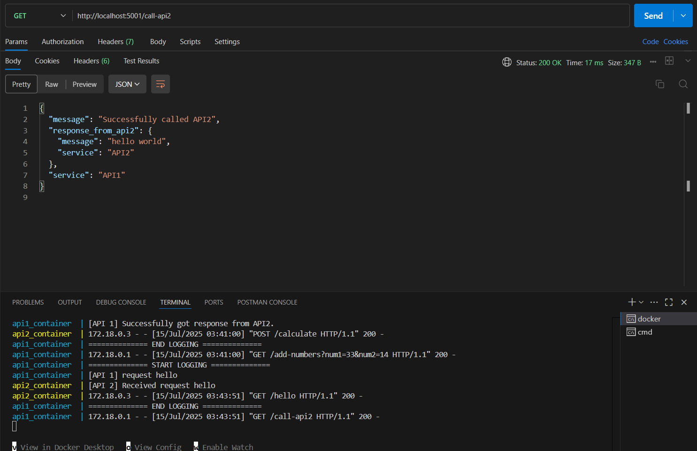
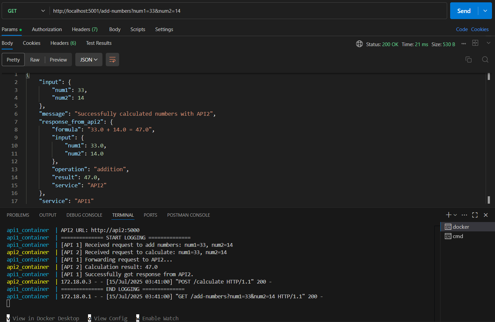

# Simple Docker Compose API System

ระบบ API ง่ายๆ ที่ API1 ติดต่อไป API2 และได้รับคำตอบ "hello world" กลับมา

## โครงสร้างโปรเจค

```
project/
├── docker-compose.yml
├── api1/
│   ├── Dockerfile
│   ├── requirements.txt
│   └── app.py
├── api2/
│   ├── Dockerfile
│   ├── requirements.txt
│   └── app.py
└── README.md
```

## วิธีการใช้งาน

```bash
docker-compose up --build
```

### ตรวจสอบการทำงาน
- API1: http://localhost:5001
- API2: http://localhost:5002

## API Endpoints

### API1 (Port 5001)
- `GET /` - หน้าหลักของ API1
- `GET /call-api2` - เรียกใช้ API2 และรับคำตอบ "hello world"
- `GET /add-numbers` - ส่งตัวเลขไปให้ API2 บวกกัน (ใช้ query parameters)
- `POST /add-numbers` - ส่งตัวเลขไปให้ API2 บวกกัน (ใช้ JSON body)

### API2 (Port 5002)
- `GET /` - หน้าหลักของ API2
- `GET /hello` - ตอบกลับด้วย "hello world"
- `POST /calculate` - รับตัวเลข 2 ตัว บวกกัน แล้วส่งผลลัพธ์กลับ

## การทดสอบ

### 1. ทดสอบ API1 เรียก API2 (Hello World)
```bash
curl http://localhost:5001/call-api2
```

### 2. ทดสอบการบวกเลข (GET method)
```bash
# ใช้ query parameters
curl "http://localhost:5001/add-numbers?num1=15&num2=25"
```

### 3. ทดสอบการบวกเลข (POST method)
```bash
curl -X POST http://localhost:5001/add-numbers \
  -H "Content-Type: application/json" \
  -d '{"num1": 30, "num2": 45}'
```

### 4. ทดสอบ API2 โดยตรง
```bash
# ทดสอบ hello endpoint
curl http://localhost:5002/hello

# ทดสอบ calculate endpoint โดยตรง
Invoke-RestMethod -Uri "http://localhost:5002/calculate" -Method POST -ContentType "application/json" -Body '{"num1": 100, "num2": 200}'
```

## ผลลัพธ์ที่คาดหวัง

### การบวกเลข
```json
{
  "service": "API1",
  "message": "Successfully calculated numbers with API2",
  "input": {"num1": 15, "num2": 25},
  "response_from_api2": {
    "service": "API2",
    "operation": "addition",
    "input": {"num1": 15.0, "num2": 25.0},
    "result": 40.0,
    "formula": "15.0 + 25.0 = 40.0"
  }
}
```

### ทดสอบ API2 โดยตรง
```json
{
  "service": "API2",
  "operation": "addition",
  "input": {"num1": 100.0, "num2": 200.0},
  "result": 300.0,
  "formula": "100.0 + 200.0 = 300.0"
}
```

## การทำงานของระบบ

### Hello World Flow:
1. **API1** รับ request ที่ `/call-api2`
2. **API1** ส่ง GET request ไปที่ **API2** endpoint `/hello`
3. **API2** ตอบกลับด้วย "hello world"
4. **API1** ส่งผลลัพธ์กลับไปยัง client

### Addition Flow:
1. **API1** รับ request ที่ `/add-numbers` พร้อมตัวเลข 2 ตัว
2. **API1** ส่ง POST request ไปที่ **API2** endpoint `/calculate`
3. **API2** บวกตัวเลขทั้ง 2 ตัว
4. **API2** ส่งผลลัพธ์กลับไปที่ **API1**
5. **API1** ส่งผลลัพธ์รวมกลับไปยัง client


### ตัวอย่างการทดสอบเรียก จาก postman และแสดง log

ตัวอย่างที่ 1 user call api1 ให้เรียก api2 แล้วส่งผลลัพธ์ hello กลับมา



ตัวอย่างที่ 2 user call api1 ให้บวกเลขโดยใส่ตัวเลข2ตัวลงไปผ่านตัวแปรที่ชื่อ `num1` และ `num2` โดย api1 เรียก api2 เพื่อบวกเลข แล้วจากนั้น api2 จะส่งผลัพธ์การบวกเลข2ตัว กลับมาที่ api1 
